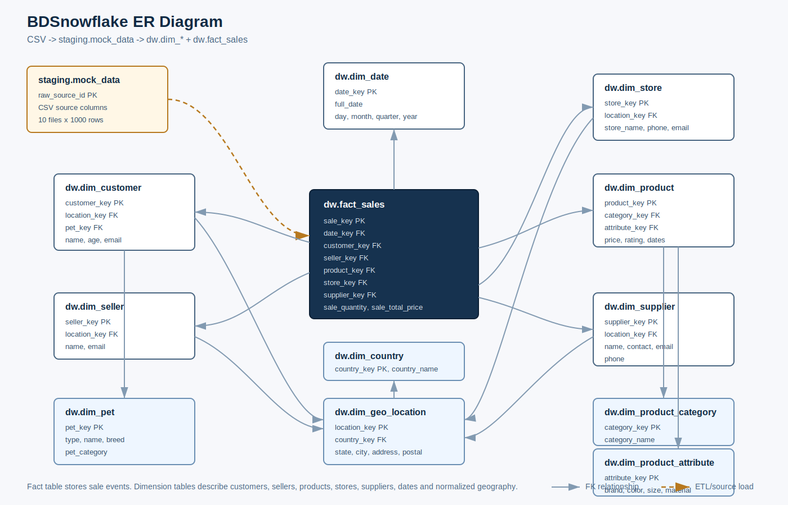

# BigDataSnowflake

Анализ больших данных - лабораторная работа №1: нормализация исходных данных в модель "снежинка".

## Что сделано

Репозиторий содержит готовую реализацию лабораторной работы:

- исходные CSV-файлы `MOCK_DATA*.csv` в папке `исходные данные`;
- `docker-compose.yml` для запуска PostgreSQL;
- автоматический импорт 10 CSV-файлов в таблицу `staging.mock_data`;
- DDL-скрипты для создания таблиц фактов и измерений;
- DML-скрипты для заполнения аналитической модели из исходных данных;
- проверочные представления для контроля результата.

## Структура проекта

```text
.
├── docker-compose.yml
├── README.md
├── исходные данные/
│   ├── MOCK_DATA.csv
│   ├── MOCK_DATA (1).csv
│   └── ...
└── sql/
    └── init/
        ├── 00_create_schemas_and_staging.sql
        ├── 01_load_source_csv.sql
        ├── 02_create_dw_model.sql
        ├── 03_fill_dw_model.sql
        └── 04_validation.sql
```

## Запуск

Нужен Docker с поддержкой Docker Compose.

```bash
docker compose up -d
```

PostgreSQL будет доступен на `localhost:5432`.

Параметры подключения:

```text
host: localhost
port: 5432
database: bdsnowflake
user: postgres
password: postgres
```

При первом старте контейнера PostgreSQL автоматически выполнит скрипты из `sql/init`:

1. создаст схемы `staging` и `dw`;
2. создаст таблицу `staging.mock_data`;
3. загрузит все 10 CSV-файлов;
4. создаст нормализованную модель данных;
5. заполнит таблицы измерений и фактов;
6. создаст проверочные представления.

Если нужно пересоздать базу с нуля:

```bash
docker compose down -v
docker compose up -d
```

## Модель данных

Сырые данные загружаются в:

- `staging.mock_data`

Аналитическая модель находится в схеме `dw`.

ER-визуализация модели:



Измерения:

- `dw.dim_country`
- `dw.dim_geo_location`
- `dw.dim_pet`
- `dw.dim_customer`
- `dw.dim_seller`
- `dw.dim_supplier`
- `dw.dim_store`
- `dw.dim_product_category`
- `dw.dim_product_attribute`
- `dw.dim_product`
- `dw.dim_date`

Факт:

- `dw.fact_sales`

Факт продаж связан с измерениями даты, клиента, продавца, товара, магазина и поставщика. География и товарные атрибуты вынесены в отдельные таблицы, поэтому модель соответствует подходу "снежинка".

## Проверка результата

Проверить количество строк в исходной и аналитических таблицах:

```sql
SELECT *
FROM dw.v_lab1_validation
ORDER BY object_name;
```

В таблице `staging.mock_data` должно быть `10000` строк. В таблице `dw.fact_sales` также должно быть `10000` строк.

Примеры аналитических запросов:

```sql
SELECT *
FROM dw.v_sales_by_country
ORDER BY total_sales_amount DESC;
```

```sql
SELECT *
FROM dw.v_sales_by_product_category
ORDER BY total_sales_amount DESC;
```

## Полезные команды

Открыть psql внутри контейнера:

```bash
docker compose exec postgres psql -U postgres -d bdsnowflake
```

Посмотреть логи и убедиться, что импорт прошел успешно:

```bash
docker compose logs postgres
```

Остановить контейнер:

```bash
docker compose down
```
